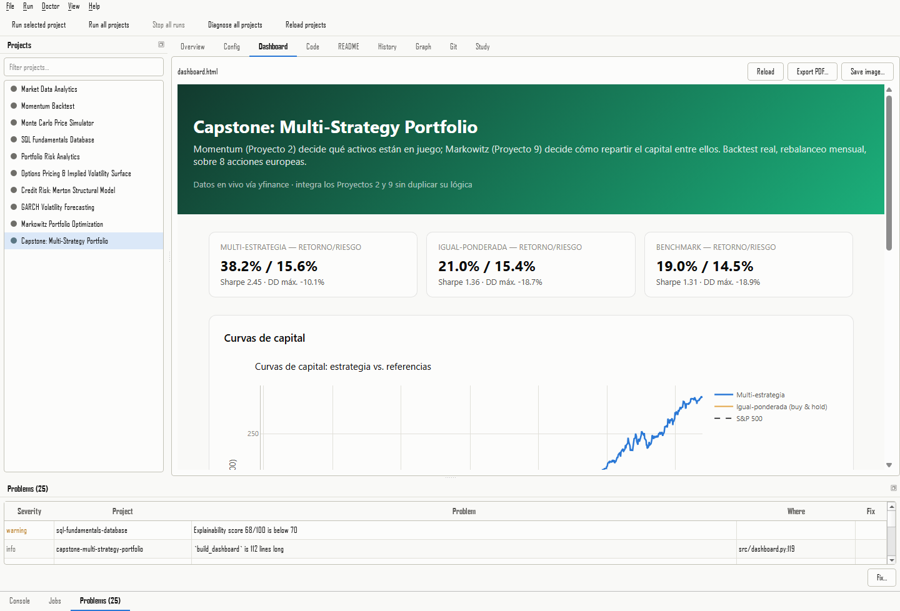
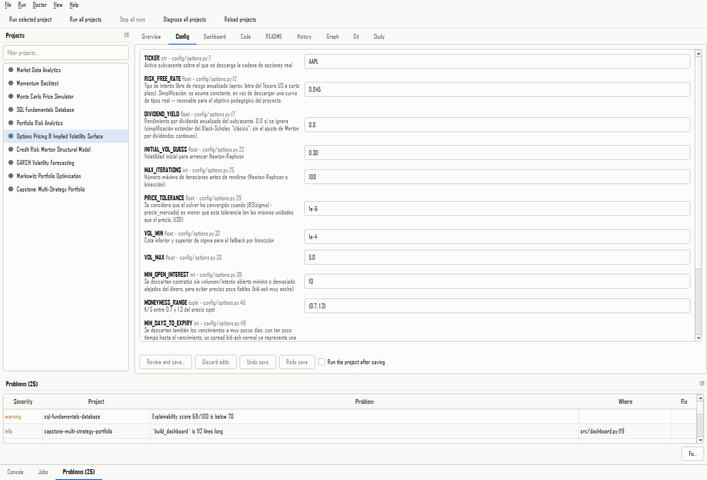
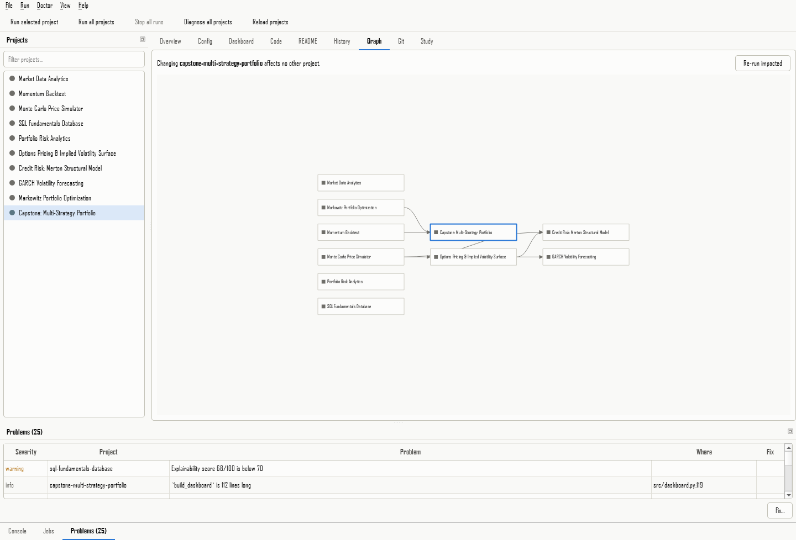
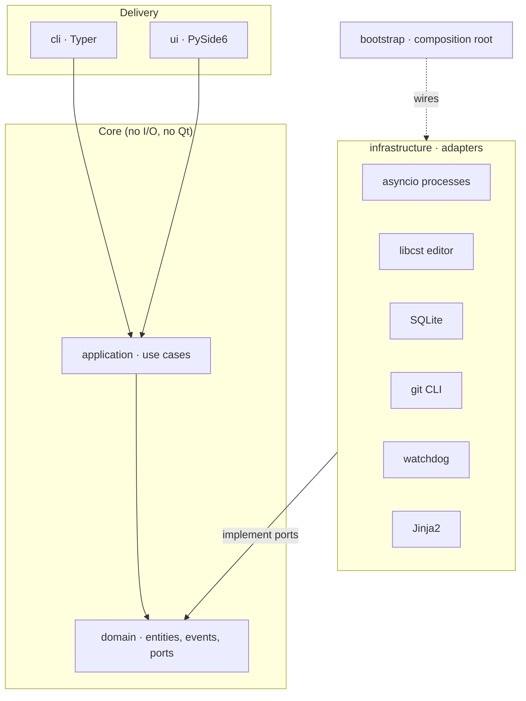

# Quant Workbench

A desktop workbench (and command-line tool) to **run, inspect, debug and extend a portfolio of
quantitative-finance projects**. It discovers the projects in a workspace, runs them in dependency
order, edits their configuration without disturbing a single byte of the surrounding code, shows their
dashboards, diagnoses the problems this portfolio has actually had, and keeps a history of every run.

It was built for a portfolio of ten Python projects (Monte Carlo, Black-Scholes and implied volatility,
GARCH, Markowitz, credit risk, a capstone that combines them...) and is designed so that project 11 needs
no code changes: drop a folder in the workspace, or generate one with `qw new`.



| | |
|---|---|
|  |  |
| Typed configuration form, with each constant's own comment as help | Dependency graph; select a project to see what it affects |

## What it does

| Area | What you get |
|---|---|
| **Catalog** | Finds projects by convention or by `quant-project.toml`; builds the dependency graph from declared dependencies **and** from static analysis of the code, and flags disagreements. |
| **Job engine** | `asyncio` engine: bounded concurrency, dependency-ordered batches, timeouts, retries with backoff for transient failures, live output, **process-tree cancellation** (no orphan interpreters), CPU/memory sampling. |
| **Config editor** | Edits constants with [libcst](https://libcst.readthedocs.io): comments, layout and Windows line endings survive **byte for byte**; every edit is verified by reading it back, previewed as a diff, undoable and backed up outside the project. |
| **Doctor** | 12 small checkers, each born from a real bug of this portfolio: environment, TLS certificates, sibling-import collisions, git identity, repository hygiene, stale outputs, static analysis, README claims vs. real results, determinism, and an *explainability score*. Fixes are additive and previewed first. |
| **History** | Every run (config snapshot, logs, exit code, metrics, outputs) in SQLite; compare two runs; chart a metric over time. |
| **Dashboards** | Each project's HTML dashboard embedded in the app (Chromium), reloaded when it changes, with Plotly cached locally so it works offline. |
| **Git panel** | Status, diff, log and a guarded commit. **It can never push** (see [ADR 0008](docs/adr/0008-views-are-lazy-and-never-change-the-project-behind-your-back.md)). |
| **New projects** | `qw new` generates a runnable project that follows the portfolio's conventions and passes the doctor. |
| **Sync** | `qw sync` rebuilds the whole workspace from the registry: clones over HTTPS, never touches an existing folder. |
| **Watch** | `qw watch` re-runs a project every time a Python file in `src/` or `config/` is saved. |
| **Study mode** | Turns each README's "Concepts to be able to explain in an interview" into flash cards scheduled with SM-2 spaced repetition. |

## Getting started

Requires Python 3.11+ and `git`.

```bash
git clone git@github.com:mariatejedorg/quant-workbench.git
cd quant-workbench
python -m venv venv
venv/Scripts/activate            # Windows; on macOS/Linux: source venv/bin/activate
pip install -e ".[gui,dev]"      # drop "gui" for the headless CLI only
```

```bash
qw list -w "path/to/workspace"   # the projects it found
qw doctor                        # what is wrong, and where
qw run-all -j 3                  # everything, in dependency order, three at a time
qw gui                           # the desktop app
```

The workspace is auto-detected from the current directory, or set with `-w` or `workspace_root` in
`settings.toml`.

### Command reference

| Command | Purpose |
|---|---|
| `qw list`, `qw graph [--impact SLUG] [-f mermaid]`, `qw schema` | Catalog, dependency graph, manifest JSON Schema |
| `qw run SLUG...`, `qw run-all [-j N] [--skip-dependents]` | Run projects |
| `qw env status\|setup`, `qw history`, `qw logs RUN_ID` | Environments and run history |
| `qw config get\|diff\|set SLUG NAME=VALUE...` | Read and edit constants safely |
| `qw doctor [--fix] [--json] [--deterministic] [--list]` | Diagnose and fix |
| `qw new SLUG`, `qw sync [--setup] [--dry-run]`, `qw watch SLUG` | Create, clone and iterate |
| `qw study [--stats]` | Practise the README concepts |
| `qw gui` | The desktop app |

## Architecture

Hexagonal: the core knows nothing about Qt, the terminal, SQLite or git. The rule is enforced by a test
that parses every import ([ADR 0001](docs/adr/0001-hexagonal-architecture.md)).



The engine runs on its own `asyncio` thread and talks to the GUI through one small bridge, which is why the
CLI and the GUI share exactly the same code ([ADR 0002](docs/adr/0002-asyncio-core-in-a-worker-thread.md)).
See [docs/architecture.md](docs/architecture.md) for the run life cycle, batches, cancellation and persistence.

### Decisions worth reading

| ADR | Decision |
|---|---|
| [0001](docs/adr/0001-hexagonal-architecture.md) | Hexagonal architecture with an enforced dependency rule |
| [0002](docs/adr/0002-asyncio-core-in-a-worker-thread.md) | `asyncio` in a worker thread, bridged to Qt signals |
| [0003](docs/adr/0003-libcst-for-config-editing.md), [0005](docs/adr/0005-config-edits-are-planned-verified-and-byte-exact.md) | Format-preserving config edits: plan, verify by read-back, byte-exact |
| [0004](docs/adr/0004-do-not-force-utf8-mode-in-child-processes.md) | Why child processes do **not** get `PYTHONUTF8` (a real bug with libcurl) |
| [0006](docs/adr/0006-the-doctor-is-a-set-of-small-rules-with-previewable-fixes.md) | The doctor: small rules, isolated failures, previewable additive fixes |
| [0007](docs/adr/0007-the-gui-talks-to-a-controller-and-a-command-registry.md), [0008](docs/adr/0008-views-are-lazy-and-never-change-the-project-behind-your-back.md) | GUI: controller + command registry; lazy views; nothing changes behind your back |
| [0009](docs/adr/0009-new-projects-and-sync-only-ever-add.md) | Scaffolding, sync and watch only ever add, and never surprise |

## Quality

- **~800 tests** in four layers: unit, property-based ([hypothesis](https://hypothesis.readthedocs.io):
  round-trip of the real config files, dependency-graph invariants, the SM-2 schedule), integration (real processes, real git
  repositories, real file watching, a workspace path with a space and an accent like the real one) and GUI
  (off-screen Qt, including the embedded browser).
- **97 % coverage** of the headless core (gate: 85 %), `ruff` and `mypy --strict` clean.
- Tests never touch the real workspace; the few that read it are read-only and skip when it is absent.
- CI runs the core without Qt installed, on Linux, Windows and macOS, Python 3.11 to 3.13
  ([.github/workflows/ci.yml](.github/workflows/ci.yml)).

```bash
pytest -m "not gui and not network"      # core, ~2 minutes
pytest tests/gui                         # desktop app, off-screen
pytest -m network                        # optional: one real clone from GitHub
```

## A three-minute demonstration

1. **See the whole portfolio.** `qw list` and `qw graph --impact monte-carlo-price-simulator` show which
   projects load which (edges found by reading the code, not only declared).
2. **Find what is wrong.** `qw doctor` on the real portfolio: 0 errors, and each note says where to look.
3. **Edit safely.** `qw config diff SLUG NAME=VALUE`: a diff with a single changed line, comments and CRLF intact.
4. **Open the app.** `qw gui`: run a project (watch the console and the job queue), open its **Dashboard**,
   change a value in **Config**, run again and compare the two runs in **History**.
5. **Create and iterate.** `qw new pairs-trading`, then `qw watch pairs-trading` and save the config file:
   the project runs again by itself.

## Design limits, stated plainly

- The workbench assumes a workspace you own: it runs the projects' code, like you would by hand.
- It never runs `git push` and never edits a global git setting; it shows the command instead.
- Watch mode is CLI-only; the GUI covers the interactive case with its run buttons.
- The screenshots are generated by `python scripts/capture_screenshots.py` (off-screen), so they show the real
  app on the real workspace.

## Repository layout

```
src/quant_workbench/
├── domain/          entities, events, pure algorithms (SM-2, graph layout, code analysis), ports
├── application/     use cases: catalog, runs, config, doctor + checkers, git, study, scaffold, sync, watch
├── infrastructure/  adapters: processes, SQLite, libcst, git CLI, watchdog, Jinja2, project files
├── cli/             Typer commands
├── ui/              PySide6: controller, models, views, widgets, theme
├── data/            registry of the ten manifests, failure signatures, project template
└── bootstrap.py     composition root (manual dependency injection)
docs/                architecture, ADRs, screenshots
scripts/             screenshot generator
```

## License

[MIT](LICENSE)
