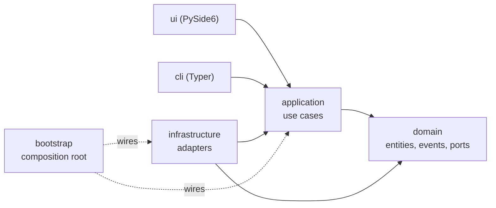

# 0001. Hexagonal architecture with an enforced dependency rule

- Status: Accepted
- Date: 2026-09-21

## Context

The workbench has two delivery mechanisms that must behave identically: a desktop GUI
and a command line (`qw run`, `qw doctor`, ...), the latter being what CI and scripts use.
It also talks to slow, failure-prone things (subprocesses, git, the network, SQLite,
source-code rewriting). If use-case logic lives in widgets, the CLI has to duplicate it and
none of it can be unit-tested without a display.

## Decision

Five packages with a one-directional dependency rule:

- **domain**: standard library only. Entities, value objects, domain events, and the *ports*
  (`typing.Protocol` interfaces) the rest of the system depends on.
- **application**: use cases. Depends on domain ports, never on a concrete adapter.
- **infrastructure**: adapters implementing the ports (asyncio subprocess runner, SQLite,
  libcst, git CLI, ...).
- **ui / cli**: thin delivery layers that call use cases and render results.
- **bootstrap**: the single composition root; the only module allowed to see every layer.

The rule is **enforced by a test** (`tests/unit/test_layering.py`) that parses every
module's imports with `ast`. It also asserts that `domain` imports nothing outside the
standard library and that Qt appears only under `ui`. A violation fails CI with the exact
file and line, so the architecture cannot erode silently.

## Consequences

- The headless core (domain + application + infrastructure + cli) installs and runs
  without Qt; the GUI is the optional `gui` extra. CI has a Qt-free job to prove it.
- Test doubles are trivial (structural typing): no mocking framework is needed for ports.
- Coverage and `mypy --strict` gates apply to the core, where the logic is.
- Cost: more files and a little indirection than a single-script tool. Accepted: this
  project exists to show that trade-off being made deliberately.

## Alternatives considered

- **Layered MVC inside the GUI only** — rejected: leaves the CLI and the tests without a
  reusable core.
- **Import-linter / tach** — a fine tool, but a 60-line stdlib test has no dependency and
  is readable enough to be documentation.
- **Dependency-injection framework** — rejected: the wiring fits on one screen
  (`bootstrap.py`); a framework would hide the thing worth reading.
