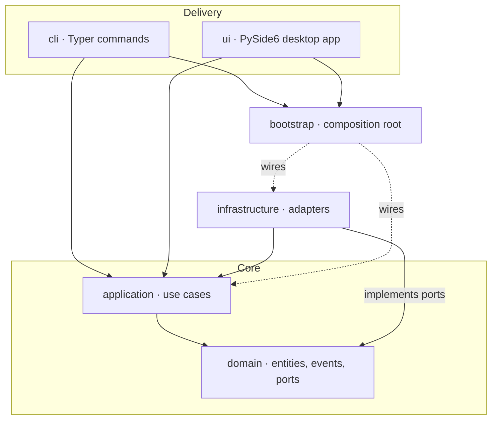
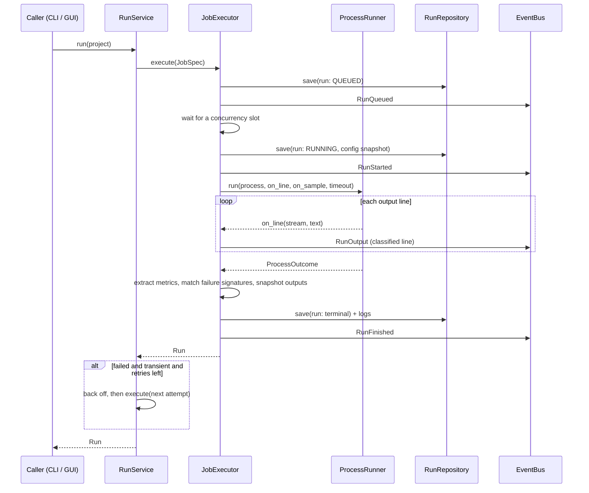
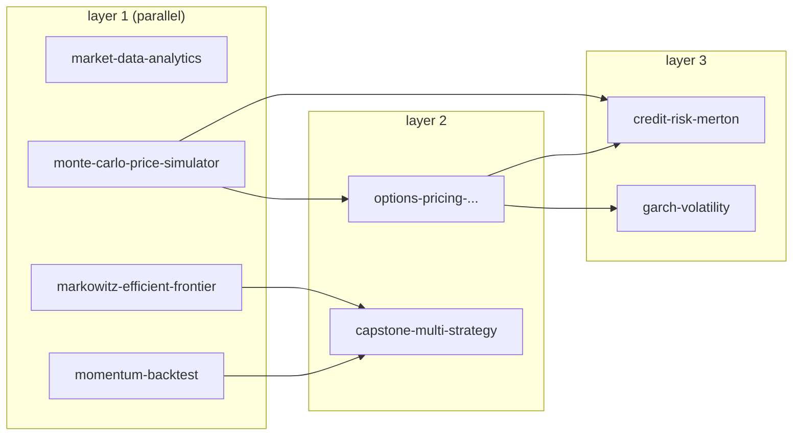

# Architecture

Quant Workbench is a hexagonal application (see [ADR 0001](adr/0001-hexagonal-architecture.md)).
This page explains how the pieces fit together; the *why* behind each choice lives in the ADRs.

## Layers

The rule "dependencies point inwards" is enforced by `tests/unit/test_layering.py`, which
parses every module's imports. It also asserts that `domain` uses only the standard library
and that Qt is imported only under `ui`.

## Running a project

`RunService.run` and `EnvironmentService.setup` are thin callers of one class, the
`JobExecutor`, which owns the life cycle of every attempt:

## Batches

`RunService.run_batch` asks the dependency graph for *generations*: layers of projects that
do not depend on each other. Each layer runs concurrently (bounded by the executor's
semaphore); a layer starts only after the previous one has finished.

## Cancellation and process trees

A project may start its own child processes. Killing only the process the runner started
would orphan them, so `AsyncSubprocessRunner` terminates the **whole tree** (via `psutil`)
on timeout and on cancellation, escalating from `terminate` to `kill` after a grace
period. Integration tests start a grandchild, cancel, and assert it is gone.

## Persistence

Runs and their output lines live in SQLite (`SqliteRunRepository`). The schema is changed
only through the ordered list in `infrastructure/migrations.py`; each migration runs in the
same transaction as the version bump. Timestamps are stored as fixed-width UTC ISO-8601
strings, so lexicographic order is chronological order. Metrics, the configuration
snapshot and the output manifest are stored as JSON on the run row.

## Data shipped with the package

`src/quant_workbench/data/` holds the registry of portfolio manifests, the failure-signature
knowledge base (TOML) and, later, the project templates. They are package data, resolved
with `importlib.resources`, so an installed wheel and an editable checkout behave alike.
